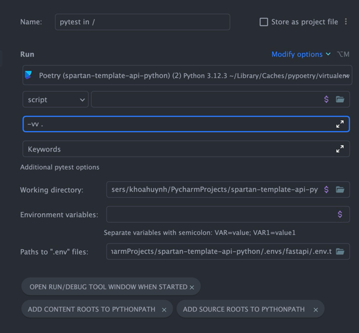
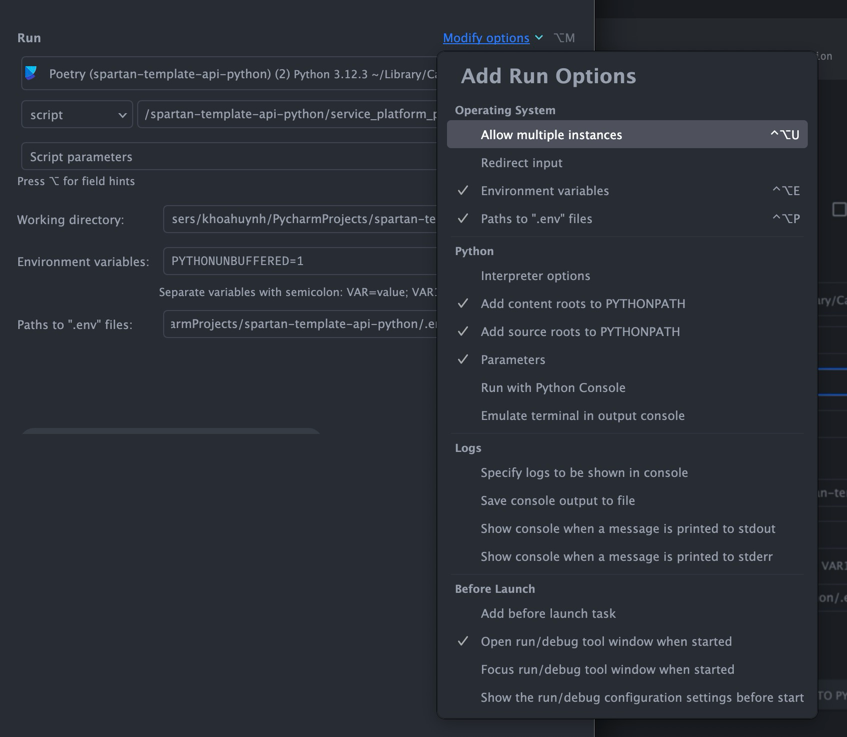

# service_platform_py

This is a template project for a python microservice using FastAPI framework.
Python 3.12 recommended.

## Configure

1. Click 'Python Interpreter'
2. Choose "Add New Interpreter" -> "Add Local Interpreter..."
3. Choose "Poetry Environment" -> Click "Poetry Environment"
4. At "Base interpreter" click dropdown and choose interpreter suitable.
5. Click "OK"

## Setting

copy `.envs/fastapi/.env.example` to `.envs/fastapi/.env`, for local we can use `.envs/fastapi/.env.local`

```bash
export ENVIRONMENT=local
```

## DB

postgres and redis can be launched on docker
`docker-compose -f docker-compose.ci.yml up -d`

## Flyway

migrate
`cd sql && flyway migrate -user=local -password=local -url=jdbc:postgresql://localhost:5432/db_py && cd -`

clean & migrate:
`cd sql && flyway clean migrate -user=local -password=local -url=jdbc:postgresql://localhost:5432/db_py && cd -`

## Poetry

This project uses poetry. It's a modern dependency management tool.

To run the project use this set of commands:

```bash
poetry install
poetry run python -m service_platform_py
```

## Testing

```bash
poetry run pytest
pytest -vv service_platform_py/tests/test_user.py::test_user_creation
```
Or run the test directly in IDE (Pycharm/VSCode)
### Run Test in IDE Pycharm (**Recommend**)

### Notes:
- Working directory should be in root path of application: `spartan-template-api-python/**`
- Load `.envs/fastapi/.env.test` with options `Paths to '.env' files`
-

## Debug in Local
### Run project in Pycharm
- Best options for run FastAPI and Debug, should use root file of application `__main__.py`
- Working directory should be in root path of application: `spartan-template-api-python/**`
- Create config and click modify options
    
    - Choose option `Paths to '.env' files`
- Load `.envs/fastapi/.env.local` with options `Paths to '.env' files`
- Apply & Run

## Pre-commit

To install pre-commit simply run inside the shell:
```bash
pre-commit install
```

pre-commit is very useful to check your code before publishing it.
It's configured using .pre-commit-config.yaml file.

By default it runs:
* ruff
* pytest

You can read more about pre-commit here: https://pre-commit.com/
